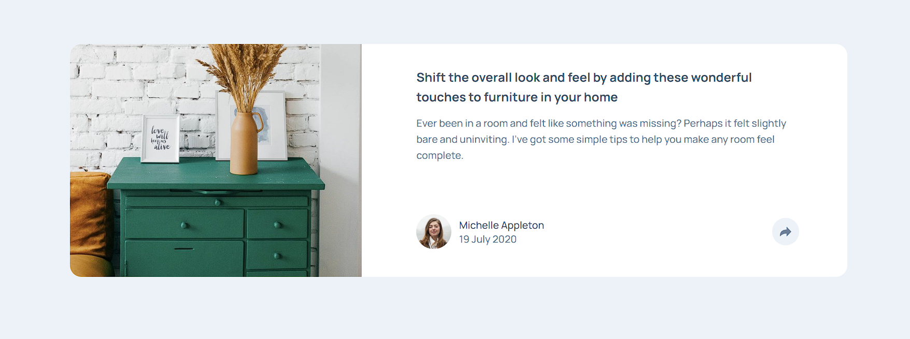

# Frontend Mentor - Responsive Article Preview

A responsive article preview component built for the Frontend Mentor's [Article Preview Component challenge](https://www.frontendmentor.io/challenges/article-preview-component-dYBN_pYFT). Built using Javascript, CSS, and HTML. Feel free to leave feed back on the Frontend Mentors page.

## Table of Contents

- [Overview](#overview)
  - [The challenge](#the-challenge)
  - [Screenshot](#screenshot)
  - [Links](#links)

## The Challenge

Users should be able to:

- View the optimal layout for the component depending on their device's screen size
- See the social media share links when they click the share icon

### Screenshot

### Links

- Solution URL: [Frontend Mentor Solution](https://www.frontendmentor.io/solutions/responsive-article-preview-using-css-grid-and-flexbox-ahUxVbJ9I)
- Live Site URL: [Vercel Link](https://article-preview-tan.vercel.app/)
